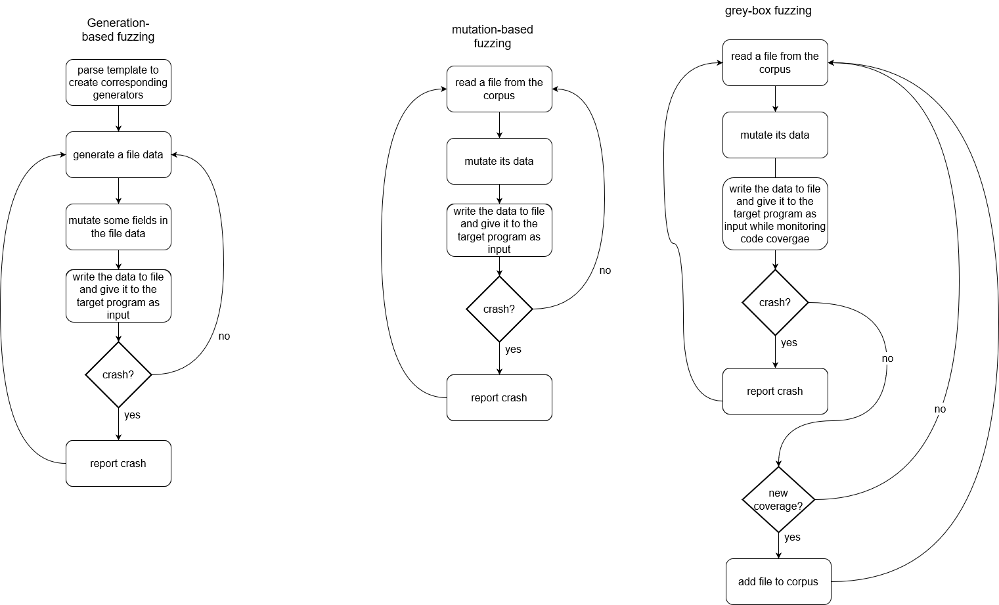

The main classes used for fuzzing are those in the `fuzzers` directory, [MutationFuzzer](../src/fuzzers/mutation_fuzzer.py) and [generator_fuzzer](../src/fuzzers/generator_fuzzer.py). 
The `main` file invoke the `fuzz_multiple` method in the fuzzer class, which uses the `fuzz_once` method to fuzz one file.  
Both fuzzers work in a similar way:
- create a file (by either reading it from the corpus or generating it).
- mutate it (by either using a [Mutator](../src/mutators/mutator.py) or by using `mutate` function of a `Field`)
- write the mutated data into a file (the file called `temp.extension` and located at the cwd).
- feed the muatted file to [Runner](../src/runner.py) and check the return code.
- reapet!

The general flow of a normal fuzzing process:

More on how the file generation works can be found [here](./file_generation.md).

Class UML for the fuzzers:

